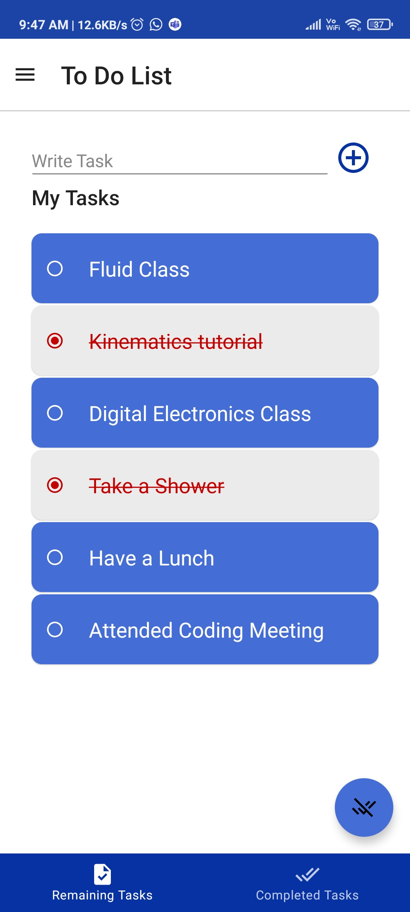
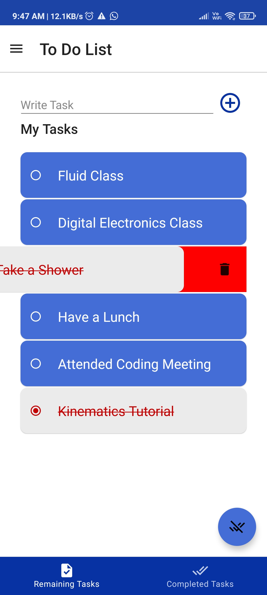
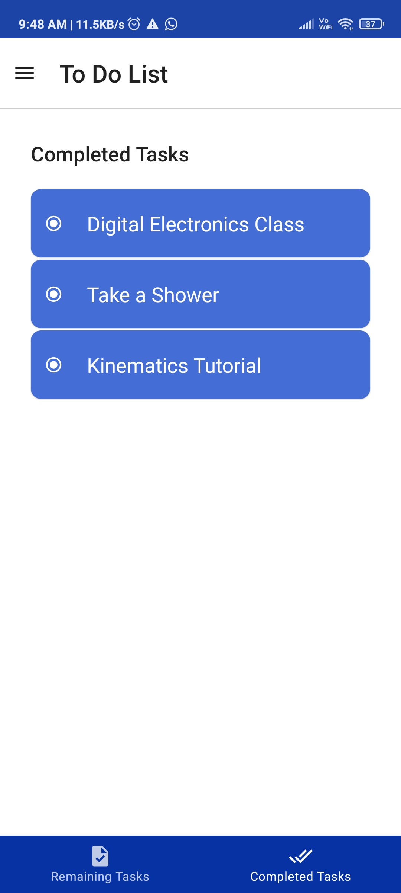

# To-Do-List-app

A simple to do list app.

<h2>Features of the app</h2>
<ul>
<li>A TextField to add task, it will also show error invalid task</li>
<li>Upon clicking on task, the task will be strike out showing it's done,vice versa</li>
<li>On clicking Clear Done tasks FAB, the done tasks will be moved to 'Completed Task' tab</li>
<li>On Swiping right to left, the task will be deleted permanently</li>
</ul>
<h2>Screenshots</h2>

The followinng are the screenshots of the app

 &nbsp; 
  &nbsp; 

  
Click <a href="https://drive.google.com/file/d/1n4d6GhoEBXT8-JhT--53u1fHhIxva9Pq/view?usp=drivesdk" target="_blank">here</a> to download the apk file! 

  

  <h2>Notes on Source Code</h2>
  <ul>
    <li>The code is entirely written in kotlin and Jetpack Compose is used for ui</li>
    <li>Clean architecture is followed (MVVM)</li>
    <li>Business logic and Presentation are kept seperate using different packages</li>
    <li>For backend, SQLite database is used using Room library</li>
    <li>Most of the logic is written in SQL Query itself</li>
    <li>The TextField is completely custom made in jetpack compose</li>
    <li>Hilt is used for dependency injection</li>
    <li>Some test cases are also written for SQLite database using JUnit4 and google truth library</li>
  </ul>
  

